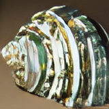
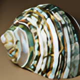
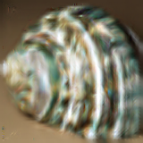
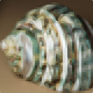

# MultiScaler Plus

## Universal app for scaling images

**MultiScaler Plus** is a universal app for scaling images using various algorithms.  
It can be used as a command line tool, a webUI, or as a console application.

This app has **2** active versions [**Main (release)**]() and [**Dev (beta)**]()  
If you use the **Main** branch and see on roadmap some feature you would like to use,  
check the **Dev** branch to see if it's already implemented!  
To switch between branches, use the `git checkout {main/dev}` command  
If feature you are interested in is not in either branch's roadmap, feel free to create a **Feature Request** issue!

## Supported algorithms
- **Classical Algorithms** (Up-scaling and downscaling):
  - **Bicubic** *(Better than bilinear, less blur, more detail, higher contrast)*
  - **Bilinear** *(Second-simplest algorithm, most common and most blurry)*
  - **Nearest neighbor** *(Simplest algorithm, duplicates or keeps only the nearest pixel)*
  - **Area** *(Averages pixels into smaller ones)* *(Only down-scaling)*
  - **Lanczos** *(Better than bicubic, less blur, higher contrast)*
- **AI-based Algorithms** (Only up-scaling):
  - **A2N**
  - **AWSRN-BAM**
  - **CARN**
  - **CARN-BAM**
  - **DRLN** *(recommended)*
  - **DRLN-BAM** *(recommended)*
  - **EDSR**
  - **EDSR-base**
  - **ESPCN**
  - **FSRCNN** *(normal and small)*
  - **HAN**
  - **LapSRN**
  - **MDSR**
  - **MDSR-BAM**
  - **MSRN**
  - **MSRN-BAM**
  - **PAN**
  - **PAN-BAM**
  - **RCAN-BAM**
  - **RealESRGAN** *(improved ESRGAN)* *(recommended)*
  - **Anime4K** *(recommended)*
  - **HSDBTRE** *(hybrid of DRLN and RealESRGAN AIs)* *(recommended)*
- **Edge Detection Algorithms** (Only up-scaling):
  - **hqx** *(edge detection algorithm, simple, not so great)*
  - **NEDI** *(New Edge-Directed Interpolation, can be better than hqx, but probably won't)*
  - **Super xBR** *(edge detection algorithm, based on xBR, more angles but more blur)*
  - **xBRZ** *(edge detection algorithm, based on xBR, better at preserving small details)*
- **Smart Algorithms** (Only up-scaling):
  - **FSR** *(FidelityFX Super Resolution 1.1, made by AMD)*
  - **CAS** *(Contrast Adaptive Sharpening, made by AMD)*

 

## Installation:
1. Make sure you have installed on your system:
   - **[Python](https://www.python.org/downloads/) 3.12** (minor version does not matter)
   - [**Node.js**](https://nodejs.org/en/download/prebuilt-installer) *(16.0.0 or newer)*
   - **[*OPTIONAL*] [Docker](https://docs.docker.com/get-docker/)** *(for **Waifu2x** & **Supir**)*
2. Clone this repository `git clone "https://github.com/MikiP98/MultiScaler-Plus"`
3. Run the included `install.bat` script

## Usage:
- **Command line tool**:
  - Run the included `run_console.bat` script
  - Run the python script manually: `python src/standalone.py`
    - You can also pass arguments to the script. Add `--help` to see the list of available arguments
- **Web GUI** *(currently lacks some functionality)*:
  - Run the included `run_webui.bat` script

 

## Examples:
### Example - Wiki Shell:

Scaled down image *(40px)*:  

A summary of best and most unique results of up-scaling the image *(40px -> 160px)*:

|                                                      Original                                                      |                                                Nearest Neighbour                                                |                                               Bicubic                                               |                                                Lanczos                                                 |
|:------------------------------------------------------------------------------------------------------------------:|:---------------------------------------------------------------------------------------------------------------:|:---------------------------------------------------------------------------------------------------:|:------------------------------------------------------------------------------------------------------:|
|  |  |  |  |

|                          DRLN*(-BAM if <4x)* *(SI)*                           |                                            RealESRGAN                                             |                                           Anime4K                                           |                                           HSDBTRE                                           |
|:----------------------------------------------------------------------------------------:|:-------------------------------------------------------------------------------------------------:|:-------------------------------------------------------------------------------------------:|:-------------------------------------------------------------------------------------------:|
|  |  |  |  |

|                               NEDI *(m = 4)*                               |                                            Super xBR                                            |                                         xBRZ                                          |                                    FSR *1.1*                                     |
|:-------------------------------------------------------------------------------------:|:-----------------------------------------------------------------------------------------------:|:-------------------------------------------------------------------------------------:|:--------------------------------------------------------------------------------:|
|  |  |  |  |

### [More detailed comparisons](./src/quality_comparison/README.md)

 

## Supported file formats:

### Tested working:

- **Write:**
  - **PNG** *(Widely used, popular, lossless format)*
  - **QOI** *(A bit worse compression then **PNG**, but a lot lot faster to save and load)*
  - **WEBP** *(Comparable, lossless and lossy compression, to **JPEG XL** (a bit worse on average), but with better overall support)*
  - **JPEG XL** *(New advanced compression format, better lossless compression compared to **PNG** and better lossy compared to **JPEG**)*   *(see [this plugin](https://github.com/saschanaz/jxl-winthumb) for Windows Support)*
  - **AVIF** *(New advanced compression format, much much slower and with worse lossless compression then **WEBP** and **JPEG XL**, currently no transparency because of a bug, pretty wide support)*
  - * See benchmarks below for more detail *

- **Read:**
  - **PNG** *(.png)*
  - **JPEG** *(.jpg, .jpeg)*

### Should work:

- **Read:**
  <table>
    <tr>
      <th>
- 
    - **APNG** *(.apng, .png2)*
    - **BLP** *(.blp, .blp2, .tex)*
    - **BMP** *(.bmp, .rle)*
    - **CUR** *(.cur)*
    - **DCX** *(.dcx)*
    - **DDS** *(.dds, .dds2)*
    - **DIB** *(.dib, .dib2)*
    - **EMF** *(.emf)*
    - **EPS** *(.eps, .eps2, .epsf, .epsi)*
    - **FITS** *(.fits)*
    - **FLC** *(.flc)*
    - **FLI** *(.fli)*
    - **FPX** *(.fpx)*
    - **FTEX** *(.ftex)*
    - **GBR** *(.gbr)*
    - **GD** *(.gd)*
    - **GIF** *(.gif, .giff)*
    - **ICNS** *(.icns, .icon)*
    - **ICO** *(.ico, .cur)*
    - **IM** *(.im, .im2)*
    - **IMT** *(.imt)*
    - **IPTC** *(.iptc)*
    - **JPEG** *(.jpg, .jpeg, .jpe)*
    - **JPEG 2000** *(.jp2, .j2k, .jpf, .jpx, .jpm, .j2c, .j2r, .jpx)*
      </th>
      <th>
-
    - **MCIDAS** *(.mcidas)*
    - **MIC** *(.mic)*
    - **MPO** *(.mpo)*
    - **MSP** *(.msp, .msp2)*
    - **NAA** *(.naa)*
    - **PCD** *(.pcd)*
    - **PCX** *(.pcx, .pcx2)*
    - **PFM** *(.pfm, .pfm2)*
    - **PIXAR** *(.pixar)*
    - **PNG** *(.png, .pns)*
    - **PPM** *(.ppm, .ppm2)*
    - **PSD** *(.psd)*
    - **QOI** *(.qoi)*
    - **SGI** *(.sgi, .rgb, .bw)*
    - **SPIDER** *(.spi, .spider2)*
    - **SUN** *(.sun)*
    - **TGA** *(.tga, .targa)*
    - **TIFF** *(.tif, .tiff, .tiff2)*
    - **WAL** *(.wal)*
    - **WMF** *(.wmf)*
    - **WebP** *(.webp, .webp2)*
    - **XBM** *(.xbm, .xbm2)*
    - **XPM** *(.xpm)*
      </th>
    </tr>
  </table>

 

## Performance:

File size and time needed to save the image using different formats with lossless+ compression.  
Tested on the [xBRZ Retexture v1.2 64x](https://modrinth.com/resourcepack/xbrz-retexture/version/1.2) Minecraft resourcepack + example shell:

| File format | Size *(B)*   | Time *(~s)* |
|:------------|:-------------|:------------|
| **PNG**     | *19 963 489* | *37.685-*   |
| **QOI**     | *30 006 495* | *2.017-*    |
| **WEBP**    | *11 396 360* | *19.904-*   |
| **JPEG XL** | *11 947 953* | *56.468-*   |
| **AVIF***   | *17 282 612* | *691.370+*  |

Different test on random collection of smaller files:

| File format | Size *(B)* |
|:------------|:-----------|
| **PNG**     | *675 397*  |
| **QOI**     | *790 448*  |
| **WEBP**    | *444 538*  |
| **JPEG XL** | *450 085*  |
| **AVIF***   | *507 384*  |

*AVIF does not have transparency for some unknown reason

[//]: # ( )

## Roadmap:

- Rewrite and update the **WebUI**
- Add support for **Waifu2x** and **Supir** AIs via **Docker**
  - Add lambda GPU *(or other)* connection support for **Supir** and others
- **Fix** and **improve** standalone console application experience:
  - Smarter Algorithms print with descriptions and categories
  - Smarter config editing with descriptions and incorrect input handling
  - Saving user config settings *(multiple **profiles**?)*
  - *(add console **buttons**?)*
- Add support for **stacked** and **animated** images
- Add **image tracing** scaling algorithm and support for **SVG** format
- Add proper **HDR** support  *(I think **JPEG XL**, **WEBP** and **AVIF** may have some already)* 
- Add better image quality comparison:
  - Summary
  - Extended summary
  - note with recommendations
- Create a **C++ python extension** for:
  - More optimizations and better performance
  - **ScaleFX** scaling shader
  - NVIDIAs **DLSS** and **NIS** support
  - support for **WEBP2** format *(both reading and writing)*
- Add support for **ZIP** and **7z** archives as input and output
- Add **filters** and **effects** support:
  - Blur
  - Sharpen
  - Noise reduction
  - Color correction
  - Color grading
  - Contrast
  - Saturation
  - Brightness
  - Exposure
  - Normal map strength
- Add basic **cropping** and **rotating** support
- Add **intelligent masking** *(to e.g. not mask the minecraft bat wing on the edge, but in a box)*
- Make my own scaling algorithm or AI for fun :)
- Add an option to blend all algorithms together instead of savin them separately
- Add some conversions:
  - Old SEUS to labPBR 1.3
  - Old Continuum to labPBR 1.3
  - PPR+Emissive (old BSL) to labPBR 1.3
  - Gray to labPBR 1.3 (most likely won't be great)
  - More?
- Add DP DSC image format?
- Covert classes into typed dictionaries to increase performance
- Add image merger: multiple images into one stacked or animated image
- Add big 160px example shell image to example images

 

## Credits:
- **WebUI**, **Scaling App** and **HSDBTRE** AI hybrid created by [***Mikołaj Pokora***](https://github.com/MikiP98)
- **API backend** and **xBRZ wheel** by [***Piotr Przetacki***](https://github.com/PiotrPrzetacki)
- [**Anime4K**](https://github.com/TianZerL/pyanime4k) implementation by [TianZer (TianZerL)](https://github.com/TianZerL)
- [**RealESRGAN**](https://github.com/ai-forever/Real-ESRGAN) implementation by [ai-forever](https://github.com/ai-forever)
- [**NEDI**](https://github.com/Kirstihly/Edge-Directed_Interpolation) implementation by [Ley (Kirstihly)](https://github.com/Kirstihly)
- [**hqx**](https://pypi.org/project/hqx/) implementation by [whoatemybutter](https://pypi.org/user/whoatemybutter/)
- [**xBRZ**](https://github.com/ioistired/xbrz.py) implementation by [ioistired](https://github.com/ioistired)
- [**Super xBR**](https://github.com/MikiP98/py-super-xbr) implementation originally created by [Matt Schwartz (n0spaces)](https://github.com/n0spaces) corrected by [Mikołaj Pokora](https://github.com/MikiP98)
- [**FSR**](https://gpuopen.com/fidelityfx-superresolution/) and [**CAS**](https://gpuopen.com/fidelityfx-cas/) are implemented using [FidelityFX-CLI](https://github.com/GPUOpen-Effects/FidelityFX-CLI) by [GPUOpen-Effects](https://github.com/GPUOpen-Effects) and [AMD](https://www.amd.com/) *(licence in "src/FidelityFX-CLI-v1.0.3")*
- ***Area***, ***Bicubic***, ***Bilinear***, ***Lanchos*** and ***Nearest neighbor*** algorithms are implemented using [OpenCV](https://opencv.org)
- ***EDSR***, ***ESPCN***, ***FSRCNN***, ***FSRCNN-small***, ***LapSRN*** AI algorithms are also implemented using [OpenCV](https://opencv.org)
- ***Nearest neighbor***, ***Bilinear***, ***Bicubic*** and ***Lanchos*** algorithms are also implemented using [Pillow library](https://pillow.readthedocs.io/en/stable/)
- ***A2N***, ***AWSRN-BAM***, ***CARN***, ***CARN-BAM***, ***DRLN***, ***DRLN-BAM***, ***EDSR***, ***EDSR-base***, ***HAN***, ***MDSR***, *...gasssp...*
- ***MDSR-BAM***, ***MSRN***, ***MSRN-BAM***, ***PAN***, ***PAN-BAM***, ***RCAN-BAM*** AI algorithms are implemented using: 
  - [super-image](https://pypi.org/project/super-image/) by [eugenesiow (Eugene Siow)](https://pypi.org/user/eugenesiow/) and [Freed Wu](https://pypi.org/user/Freed-Wu/)
- [**QOI file format support library**](https://github.com/kodonnell/qoi) by [kodonnell](https://github.com/kodonnell)
- [**AVIF PIL plugin**](https://pypi.org/project/pillow-avif-plugin/) by [fdintino](https://pypi.org/user/fdintino/)
- [**JPEG XL PIL plugin**](https://pypi.org/project/pillow-jxl-plugin/) by [Isotr0py](https://pypi.org/user/Isotr0py/)
- **Example Shell** image: 
  - [Green Sea Shell 160 thumbnail](https://commons.wikimedia.org/wiki/File:160_by_160_thumbnail_of_%27Green_Sea_Shell%27.png) by James Petts / shaddim and 
  - [Green Sea Shell 40 thumbnail](https://commons.wikimedia.org/wiki/File:40_by_40_thumbnail_of_%27Green_Sea_Shell%27.png) by James Petts, 
  - under: [CC BY-SA 2.5](https://creativecommons.org/licenses/by-sa/2.5), via Wikimedia Commons

- **Download** icon: <a href="https://www.flaticon.com/free-icons/install" title="install icons">Install icons created by NajmunNahar - Flaticon</a>

- **Web GUI** icon: <a href="https://www.flaticon.com/free-icons/interface" title="interface icons">Interface icons created by Freepik - Flaticon</a>

- **Console** icon: <a target="_blank" href="https://icons8.com/icon/nRH1nzeThlgk/console">Console</a> icon by <a target="_blank" href="https://icons8.com">Icons8</a>

