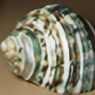
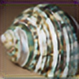
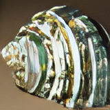
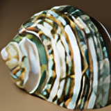
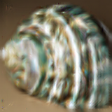
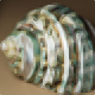
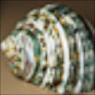

# AutoUpscale

## Universal app for scaling images

AutoUpscale is a universal app for scaling images. It can be used as a command line tool, a web GUI, or a console application.

### Supported algorithms
- **Classical Algorithms** (Up-scaling and downscaling):
  - **Bicubic** *(Better than bilinear, less blur, more detail, higher contrast)*
  - **Bilinear** *(Second-simplest algorithm, most common and most blurry)*
  - **Nearest neighbor** *(Simplest algorithm, duplicates or keeps only the nearest pixel)*
  - **Area** *(Averages pixels into smaller ones)* *(Only down-scaling)*
  - **Lanczos** *(Better than bicubic, less blur, higher contrast)*
- **AI-based Algorithms** (Only up-scaling):
  - **EDSR**
  - **ESPCN**
  - **FSRCNN** *(normal and small)*
  - **LapSRN**
  - **RealESRGAN** *(improved ESRGAN)*
  - **Anime4K**
- **Edge Detection Algorithms** (Only up-scaling):
  - **hqx** *(edge detection algorithm, simple, not so great)*
  - **NEDI** *(New Edge-Directed Interpolation, can be better than hqx, but probably won't)*
  - **Super xBR** *(edge detection algorithm, based on xBR, more angles but more blur)*
  - **xBRZ** *(edge detection algorithm, based on xBR, better at preserving small details)*
- **Smart Algorithms** (Only up-scaling):
  - **FSR** *(FidelityFX Super Resolution 1.1, made by AMD)*
  - **CAS** *(Contrast Adaptive Sharpening, made by AMD)*

 

### Installation:
1. Make sure you have installed on your system:
   - **Python 3.12**
   - **Node.js** *(16.0.0 or newer)*
2. Clone this repository
3. Run the included `install.bat` script

### Usage:
- **Command line tool**:
  - Run the included `run_console.bat` script
  - Run the python script manually: `python src/standalone.py`
    - You can also pass arguments to the script. Add `--help` to see the list of available arguments
- **Web GUI** *(currently lacks some functionality)*:
  - Run the included `run_webui.bat` script

 

### Examples:
**Example - Wiki Shell:**

Scaled down image *(40px)*:

Results of up-scaling the image *(40px -> 160px)*:

| Original | Nearest Neighbour | Bilinear | Bicubic |
| :---: | :---: | :---: | :---: |
|  |  |  |  |

| Lanczos | EDSR *(CV2)* | ESPCN *(CV2)* | FSRCNN *(CV2)* |
| :---: | :---: | :---: | :---: |
|  |  |  |  |

| FSRCNN-small *(CV2)* | LapSRN *(CV2)* | A2N *(SI)* | AWSRN-BAM *(SI)* |
| :---: | :---: | :---: | :---: |
|  |  |  |  |

| CARN *(SI)* | CARN-BAM *(SI)* | DRLN *(SI)* | DRLN-BAM *(SI)* |
| :---: | :---: | :---: | :---: |
|  |  |  |  |

| EDSR *(SI)* | EDSR-base *(SI)* | HAN *(SI)* | MDSR *(SI)* |
| :---: | :---: | :---: | :---: |
|  |  |  |  |

| MDSR-BAM *(SI)* | MSRN *(SI)* | MSRN-BAM *(SI)* | PAN *(SI)* |
| :---: | :---: | :---: | :---: |
|  |  |  |  |

| PAN-BAM *(SI)* | RCAN-BAM *(SI)* | RealESRGAN | Anime4K |
| :---: | :---: | :---: | :---: |
|  |  |  |  |

| HSDBTRE | hqx | NEDI *(m = 4)* | Super xBR |
| :---: | :---: | :---: | :---: |
|  |  |  |  |

| xBRZ | FSR | CAS *(sharpness = 0.5)* |
| :---: | :---: | :---: |
|  |  |  |

 

### Supported file formats:
**Tested working:**
- **Write:**
  - **PNG**
- **Read:**
  - **PNG** *(.png)*
  - **JPEG** *(.jpg, .jpeg)*

**Should work:**
- **Read:**
  <table>
    <tr>
      <th>
- 
    - **APNG** *(.apng, .png2)*
    - **BLP** *(.blp, .blp2, .tex)*
    - **BMP** *(.bmp, .rle)*
    - **CUR** *(.cur)*
    - **DCX** *(.dcx)*
    - **DDS** *(.dds, .dds2)*
    - **DIB** *(.dib, .dib2)*
    - **EMF** *(.emf)*
    - **EPS** *(.eps, .eps2, .epsf, .epsi)*
    - **FITS** *(.fits)*
    - **FLC** *(.flc)*
    - **FLI** *(.fli)*
    - **FPX** *(.fpx)*
    - **FTEX** *(.ftex)*
    - **GBR** *(.gbr)*
    - **GD** *(.gd)*
    - **GIF** *(.gif, .giff)*
    - **ICNS** *(.icns, .icon)*
    - **ICO** *(.ico, .cur)*
    - **IM** *(.im, .im2)*
    - **IMT** *(.imt)*
    - **IPTC** *(.iptc)*
    - **JPEG** *(.jpg, .jpeg, .jpe)*
    - **JPEG 2000** *(.jp2, .j2k, .jpf, .jpx, .jpm, .j2c, .j2r, .jpx)*
      </th>
      <th>
-
    - **MCIDAS** *(.mcidas)*
    - **MIC** *(.mic)*
    - **MPO** *(.mpo)*
    - **MSP** *(.msp, .msp2)*
    - **NAA** *(.naa)*
    - **PCD** *(.pcd)*
    - **PCX** *(.pcx, .pcx2)*
    - **PFM** *(.pfm, .pfm2)*
    - **PIXAR** *(.pixar)*
    - **PNG** *(.png, .pns)*
    - **PPM** *(.ppm, .ppm2)*
    - **PSD** *(.psd)*
    - **QOI** *(.qoi)*
    - **SGI** *(.sgi, .rgb, .bw)*
    - **SPIDER** *(.spi, .spider2)*
    - **SUN** *(.sun)*
    - **TGA** *(.tga, .targa)*
    - **TIFF** *(.tif, .tiff, .tiff2)*
    - **WAL** *(.wal)*
    - **WMF** *(.wmf)*
    - **WebP** *(.webp, .webp2)*
    - **XBM** *(.xbm, .xbm2)*
    - **XPM** *(.xpm)*
      </th>
    </tr>
  </table>

 

### Credits:
- **WebUI**, **Scaling App** and **HSDBTRE** AI hybrid created by [***Mikołaj Pokora***](https://github.com/MikiP98)
- **API backend** and **xBRZ wheel** by [***Piotr Przetacki***](https://github.com/PiotrPrzetacki)
- [**Anime4K**](https://github.com/TianZerL/pyanime4k) implementation by [TianZer (TianZerL)](https://github.com/TianZerL)
- [**RealESRGAN**](https://github.com/ai-forever/Real-ESRGAN) implementation by [ai-forever](https://github.com/ai-forever)
- [**NEDI**](https://github.com/Kirstihly/Edge-Directed_Interpolation) implementation by [Ley (Kirstihly)](https://github.com/Kirstihly)
- [**hqx**](https://pypi.org/project/hqx/) implementation by [whoatemybutter](https://pypi.org/user/whoatemybutter/)
- [**xBRZ**](https://github.com/ioistired/xbrz.py) implementation by [ioistired](https://github.com/ioistired)
- [**Super xBR**](https://github.com/MikiP98/py-super-xbr) implementation originally created by [Matt Schwartz (n0spaces)](https://github.com/n0spaces) corrected by [Mikołaj Pokora](https://github.com/MikiP98)
- [**FSR**](https://gpuopen.com/fidelityfx-superresolution/) and [**CAS**](https://gpuopen.com/fidelityfx-cas/) are implemented using [FidelityFX-CLI](https://github.com/GPUOpen-Effects/FidelityFX-CLI) by [GPUOpen-Effects](https://github.com/GPUOpen-Effects) and [AMD](https://www.amd.com/) *(licence in "src/FidelityFX-CLI-v1.0.3")*
- ***Area***, ***Bicubic***, ***Bilinear***, ***Lanchos*** and ***Nearest neighbor*** algorithms are implemented using [OpenCV](https://opencv.org)
- ***EDSR***, ***ESPCN***, ***FSRCNN***, ***FSRCNN-small***, ***LapSRN*** AI algorithms are also implemented using [OpenCV](https://opencv.org)
- ***Nearest neighbor***, ***Bilinear***, ***Bicubic*** and ***Lanchos*** algorithms are also implemented using [Pillow library](https://pillow.readthedocs.io/en/stable/)
- ***A2N***, ***AWSRN-BAM***, ***CARN***, ***CARN-BAM***, ***DRLN***, ***DRLN-BAM***, ***EDSR***, ***EDSR-base***, ***HAN***, ***MDSR***, ***MDSR-BAM***, .*..hyyy*
- ***MSRN***, ***MSRN-BAM***, ***PAN***, ***PAN-BAM***, ***RCAN-BAM*** AI algorithms are implemented using [super-image](https://pypi.org/project/super-image/) by [eugenesiow (Eugene Siow)](https://pypi.org/user/eugenesiow/) and [Freed Wu](https://pypi.org/user/Freed-Wu/)

- **Download** icon: <a href="https://www.flaticon.com/free-icons/install" title="install icons">Install icons created by NajmunNahar - Flaticon</a>

- **Web GUI** icon: <a href="https://www.flaticon.com/free-icons/interface" title="interface icons">Interface icons created by Freepik - Flaticon</a>

- **Console** icon: <a target="_blank" href="https://icons8.com/icon/nRH1nzeThlgk/console">Console</a> icon by <a target="_blank" href="https://icons8.com">Icons8</a>

