# Quality comparisons between algorithms

[Back to main README](../../../../README.md)

## Summary:

*(best algorithms from every category plus unique ones)*

 

### Wiki Example Shell *(40px -> 160px)*:

Scaled down image *(40px)*:  

|                                                      Original                                                      |                                                 Nearest Neighbour                                                 |                                          Bicubic *(PIL)*                                          |                                          Lanczos *(PIL)*                                          |
|:------------------------------------------------------------------------------------------------------------------:|:-----------------------------------------------------------------------------------------------------------------:|:-------------------------------------------------------------------------------------------------:|:-------------------------------------------------------------------------------------------------:|
|  |  |  |  |

|                           DRLN*(-BAM if <4x)* *(SI)*                            |                                             RealESRGAN                                              |                                            Anime4K                                            |                                            HSDBTRE                                            |
|:------------------------------------------------------------------------------------------:|:---------------------------------------------------------------------------------------------------:|:---------------------------------------------------------------------------------------------:|:---------------------------------------------------------------------------------------------:|
|  | 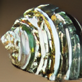 |  | 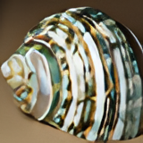 |

|                                NEDI *(m = 4)*                                |                                             Super xBR                                             |                                          xBRZ                                           |                                       FSR *1.1*                                       |
|:---------------------------------------------------------------------------------------:|:-------------------------------------------------------------------------------------------------:|:---------------------------------------------------------------------------------------:|:-------------------------------------------------------------------------------------:|
| 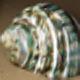 |  | 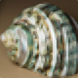 |  |

 

### Wiki Example Shell *(160px -> 640px)*:

[//]: # (TODO: Update bicubic to PIL implementation (switch to lanchos?\))

|                                    Original                                    |                                            Nearest Neighbour *(CV2)*                                            |
|:------------------------------------------------------------------------------:|:---------------------------------------------------------------------------------------------------------------:|
| 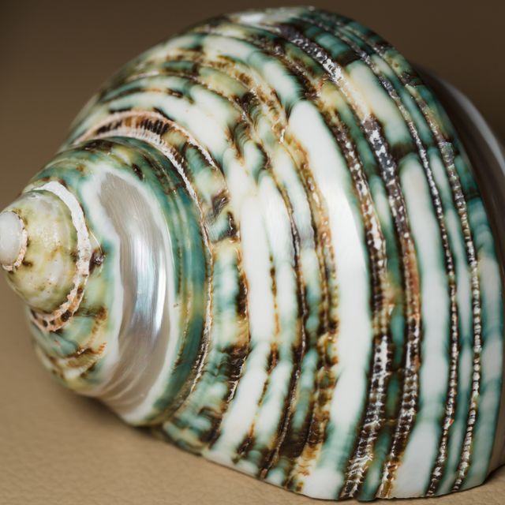 |  |

|                                         Bicubic *(PIL)*                                         |                                         Lanchos *(PIL)*                                         |
|:-----------------------------------------------------------------------------------------------:|:-----------------------------------------------------------------------------------------------:|
|  |  |

|                                       DRLN*(-BAM if <4x)* *(SI)*                                       |                                        RealESRGAN                                         |
|:-----------------------------------------------------------------------------------------------------------------:|:-----------------------------------------------------------------------------------------:|
| 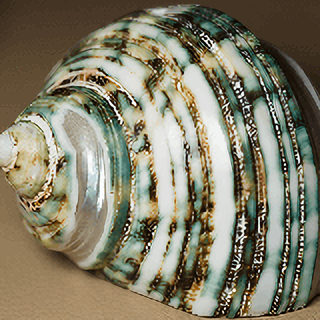 | 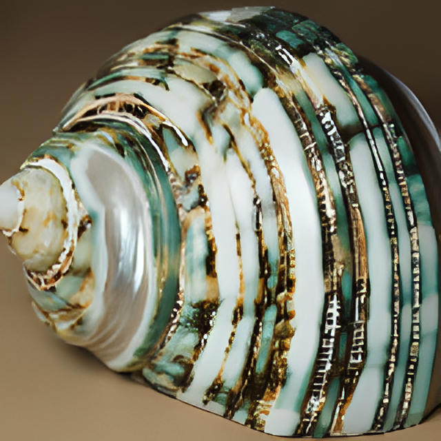 |

|                                       Anime4K                                       |                                       HSDBTRE                                       |
|:-----------------------------------------------------------------------------------:|:-----------------------------------------------------------------------------------:|
|  |  |

|                                     NEDI *(m = 4)*                                      |                                        Super xBR                                        |
|:--------------------------------------------------------------------------------------------------:|:---------------------------------------------------------------------------------------:|
| 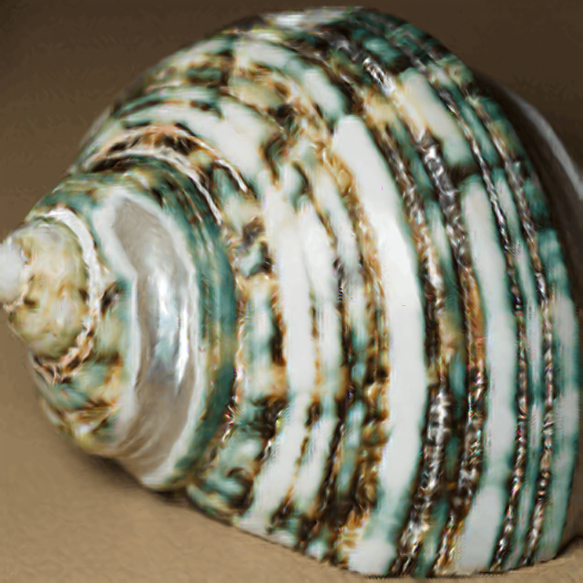 | 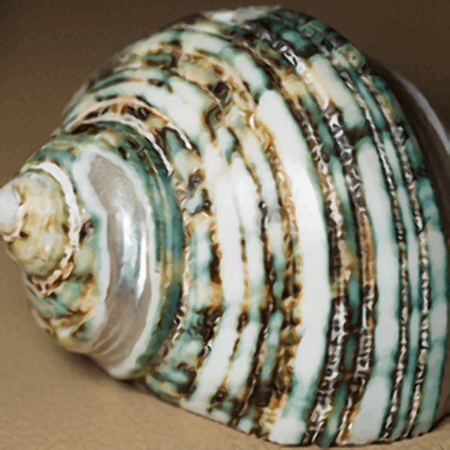 |

|                                     xBRZ                                      |                                     FSR *1.1*                                     |
|:-----------------------------------------------------------------------------:|:---------------------------------------------------------------------------------:|
| 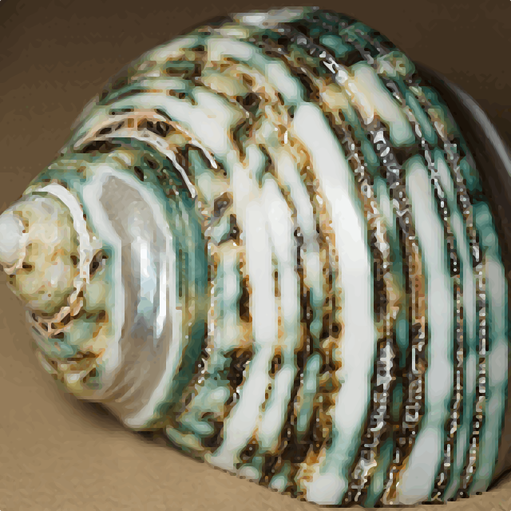 |  |

 

### Wiki example text *(40x109 -> 160x436)*:

images coming soon

   

## All:
*(All algorithms one after another)*

 

### Wiki Example Shell (40 -> 160):

|                                                      Original                                                      |                                                 Nearest Neighbour *(CV2)*                                                 |                                              Bilinear *(PIL)*                                               |                                              Bicubic *(PIL)*                                              |
|:------------------------------------------------------------------------------------------------------------------:|:-------------------------------------------------------------------------------------------------------------------------:|:-----------------------------------------------------------------------------------------------------------:|:---------------------------------------------------------------------------------------------------------:|
|  |  |  |  |

|                                              Lanczos *(PIL)*                                              |                                              Hamming *(PIL)*                                              |                                                Bilinear *(CV2)*                                                 |                                                Bicubic *(CV2)*                                                |
|:---------------------------------------------------------------------------------------------------------:|:---------------------------------------------------------------------------------------------------------:|:---------------------------------------------------------------------------------------------------------------:|:-------------------------------------------------------------------------------------------------------------:|
|  |  |  |  |

|                                                 Lanczos *(CV2)*                                                  |                                            EDSR *(CV2)*                                             |                                             ESPCN *(CV2)*                                             |                                             FSRCNN *(CV2)*                                              |
|:----------------------------------------------------------------------------------------------------------------:|:---------------------------------------------------------------------------------------------------:|:-----------------------------------------------------------------------------------------------------:|:-------------------------------------------------------------------------------------------------------:|
|  |  |  |  |

|                                                FSRCNN-small *(CV2)*                                                 |                                             LapSRN *(CV2)*                                              |                                           A2N *(SI)*                                            |                                              AWSRN-BAM *(SI)*                                               |
|:-------------------------------------------------------------------------------------------------------------------:|:-------------------------------------------------------------------------------------------------------:|:-----------------------------------------------------------------------------------------------:|:-----------------------------------------------------------------------------------------------------------:|
|  |  |  | 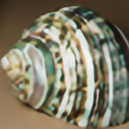 |

|                                            CARN *(SI)*                                            |                                              CARN-BAM *(SI)*                                              |                                            DRLN *(SI)*                                            |                                              DRLN-BAM *(SI)*                                              |
|:-------------------------------------------------------------------------------------------------:|:---------------------------------------------------------------------------------------------------------:|:-------------------------------------------------------------------------------------------------:|:---------------------------------------------------------------------------------------------------------:|
|  |  |  |  |

|                                            EDSR *(SI)*                                            |                                              EDSR-base *(SI)*                                               |                                           HAN *(SI)*                                            |                                            MDSR *(SI)*                                            |
|:-------------------------------------------------------------------------------------------------:|:-----------------------------------------------------------------------------------------------------------:|:-----------------------------------------------------------------------------------------------:|:-------------------------------------------------------------------------------------------------:|
|  |  |  |  |

|                                              MDSR-BAM *(SI)*                                              |                                            MSRN *(SI)*                                            |                                              MSRN-BAM *(SI)*                                              |                                           PAN *(SI)*                                            |
|:---------------------------------------------------------------------------------------------------------:|:-------------------------------------------------------------------------------------------------:|:---------------------------------------------------------------------------------------------------------:|:-----------------------------------------------------------------------------------------------:|
|  |  |  |  |

|                                             PAN-BAM *(SI)*                                              |                                              RCAN-BAM *(SI)*                                              |                                             RealESRGAN                                              |                                            Anime4K                                            |
|:-------------------------------------------------------------------------------------------------------:|:---------------------------------------------------------------------------------------------------------:|:---------------------------------------------------------------------------------------------------:|:---------------------------------------------------------------------------------------------:|
|  | 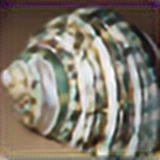 |  |  |

|                                            HSDBTRE                                            |                                          hqx                                          |                                          NEDI *(m = 4)*                                           |                                             Super xBR                                             |
|:---------------------------------------------------------------------------------------------:|:-------------------------------------------------------------------------------------:|:------------------------------------------------------------------------------------------------------------:|:-------------------------------------------------------------------------------------------------:|
|  |  |  |  |

|                                          xBRZ                                           |                                          FSR                                          |                                          CAS *(sharpness = 0.5)*                                          |                                             Repetition                                              |
|:---------------------------------------------------------------------------------------:|:-------------------------------------------------------------------------------------:|:--------------------------------------------------------------------------------------------------------------------:|:---------------------------------------------------------------------------------------------------:|
|  |  | 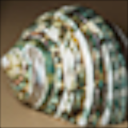 | 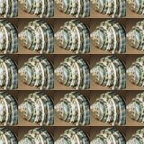 |

 

### Wiki example text *(40x109 -> 160x436)*:

images coming soon

   

## Recommendations:

coming soon

 

### [Back to main README](../../../../README.md)

 

*
This file contains shell images that are derived from works licensed under Creative Commons Attribution-ShareAlike 2.5 and 2.0. 
These images, including any modifications, are licensed under the Creative Commons Attribution-ShareAlike 4.0 International License.
*