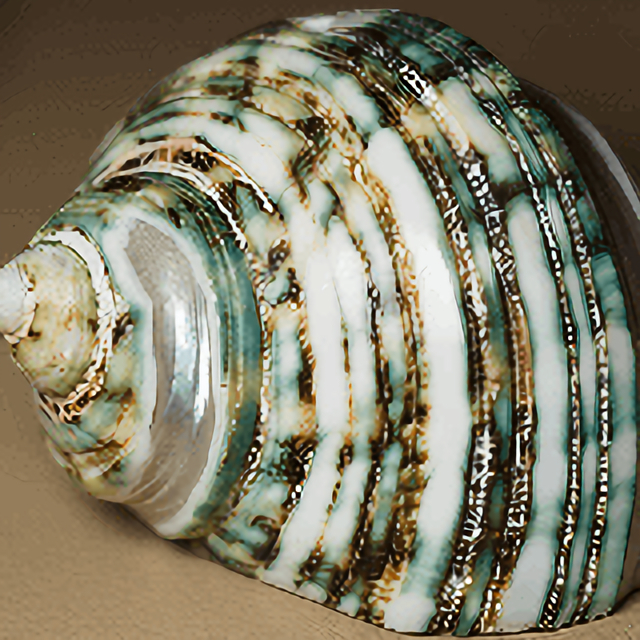
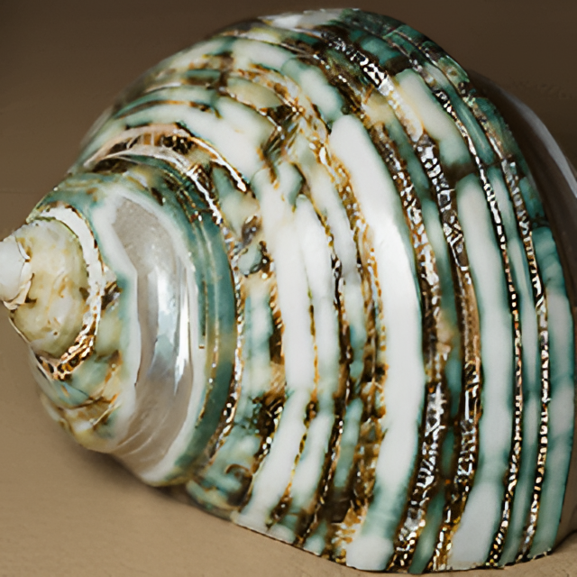
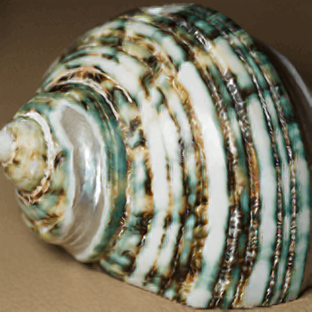
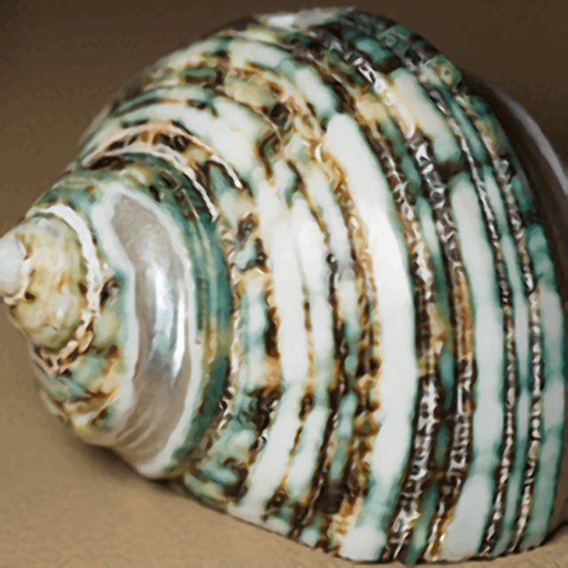
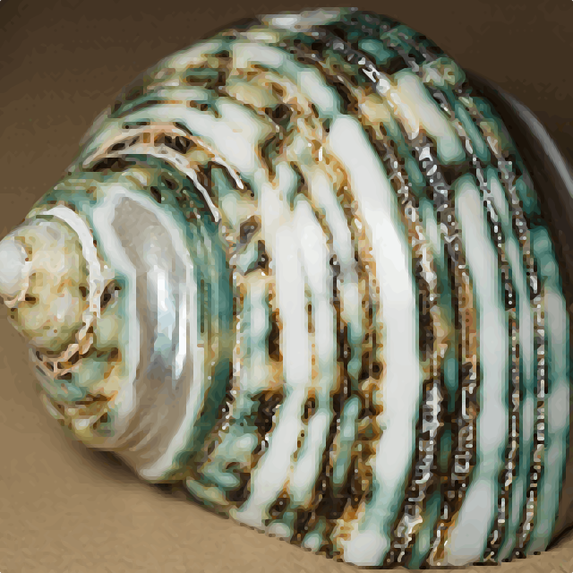
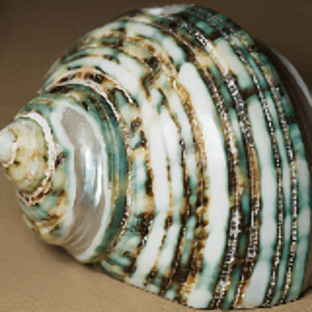

# Quality comparisons between algorithms

[Back to main README](../../README.md)

## Summary:

*(best algorithms from every category plus unique ones)*

### Wiki Example Shell *(40px -> 160px)*:

|                                                      Original                                                      |                                               Nearest Neighbour                                               |                                              Bicubic                                              |                                               Lanczos                                                |
|:------------------------------------------------------------------------------------------------------------------:|:-------------------------------------------------------------------------------------------------------------:|:-------------------------------------------------------------------------------------------------:|:----------------------------------------------------------------------------------------------------:|
|  |  |  |  |

|                         DRLN*(-BAM if <4x)* *(SI)*                          |                                           RealESRGAN                                            |                                          Anime4K                                          |                                          HSDBTRE                                          |
|:--------------------------------------------------------------------------------------:|:-----------------------------------------------------------------------------------------------:|:-----------------------------------------------------------------------------------------:|:-----------------------------------------------------------------------------------------:|
|  |  |  |  |

|                              NEDI *(m = 4)*                              |                                           Super xBR                                           |                                        xBRZ                                         |                                   FSR *1.1*                                    |
|:-----------------------------------------------------------------------------------:|:---------------------------------------------------------------------------------------------:|:-----------------------------------------------------------------------------------:|:------------------------------------------------------------------------------:|
|  |  |  |  |

### Wiki Example Shell *(160px -> 640px)*:

|                                          Nearest Neighbour                                           |                                         Bicubic                                          |
|:----------------------------------------------------------------------------------------------------:|:----------------------------------------------------------------------------------------:|
|  |  |

|                     DRLN*(-BAM if <4x)* *(SI)*                     |                                       RealESRGAN                                       |
|:-----------------------------------------------------------------------------:|:--------------------------------------------------------------------------------------:|
|  |  |

|                                     Anime4K                                      |                                     HSDBTRE                                      |
|:--------------------------------------------------------------------------------:|:--------------------------------------------------------------------------------:|
|  |  |

|                         NEDI *(m = 4)*                          |                                      Super xBR                                       |
|:--------------------------------------------------------------------------:|:------------------------------------------------------------------------------------:|
|  |  |

|                                    xBRZ                                    |                               FSR *1.1*                               |
|:--------------------------------------------------------------------------:|:---------------------------------------------------------------------:|
|  |  |

### Wiki example text *(40x109 -> 160x436)*:

images coming soon

## All:
*(All algorithms one after another)*

### Wiki Exaple Shell (40 -> 160):

images coming soon

### Wiki example text:

images coming soon

 

## Recommendations:

coming soon