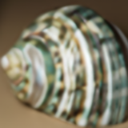

# Quality comparisons between algorithms

[Back to main README](../../README.md)

## Summary:

*(best algorithms from every category plus unique ones)*

### Wiki Example Shell *(40px -> 160px)*:

Scaled down image *(40px)*:  

|                                                      Original                                                      |                                               Nearest Neighbour                                                |                                              Bicubic                                               |                                                Lanczos                                                |
|:------------------------------------------------------------------------------------------------------------------:|:--------------------------------------------------------------------------------------------------------------:|:--------------------------------------------------------------------------------------------------:|:-----------------------------------------------------------------------------------------------------:|
|  |  |  |  |

|                          DRLN*(-BAM if <4x)* *(SI)*                          |                                            RealESRGAN                                            |                                          Anime4K                                           |                                          HSDBTRE                                           |
|:---------------------------------------------------------------------------------------:|:------------------------------------------------------------------------------------------------:|:------------------------------------------------------------------------------------------:|:------------------------------------------------------------------------------------------:|
|  |  |  |  |

|                              NEDI *(m = 4)*                               |                                           Super xBR                                            |                                         xBRZ                                         |                                    FSR *1.1*                                    |
|:------------------------------------------------------------------------------------:|:----------------------------------------------------------------------------------------------:|:------------------------------------------------------------------------------------:|:-------------------------------------------------------------------------------:|
|  |  |  |  |

### Wiki Example Shell *(160px -> 640px)*:

|                                          Nearest Neighbour                                           |                                         Bicubic                                          |
|:----------------------------------------------------------------------------------------------------:|:----------------------------------------------------------------------------------------:|
|  |  |

|                     DRLN*(-BAM if <4x)* *(SI)*                     |                                       RealESRGAN                                       |
|:-----------------------------------------------------------------------------:|:--------------------------------------------------------------------------------------:|
|  |  |

|                                     Anime4K                                      |                                     HSDBTRE                                      |
|:--------------------------------------------------------------------------------:|:--------------------------------------------------------------------------------:|
|  |  |

|                         NEDI *(m = 4)*                          |                                      Super xBR                                       |
|:--------------------------------------------------------------------------:|:------------------------------------------------------------------------------------:|
|  |  |

|                                    xBRZ                                    |                               FSR *1.1*                               |
|:--------------------------------------------------------------------------:|:---------------------------------------------------------------------:|
|  |  |

### Wiki example text *(40x109 -> 160x436)*:

images coming soon

## All:
*(All algorithms one after another)*

### Wiki Exaple Shell (40 -> 160):

|                                                      Original                                                      |                                               Nearest Neighbour                                                |                                               Bilinear                                               |                                              Bicubic                                               |
|:------------------------------------------------------------------------------------------------------------------:|:--------------------------------------------------------------------------------------------------------------:|:----------------------------------------------------------------------------------------------------:|:--------------------------------------------------------------------------------------------------:|
|  |  |  |  |

|                                                Lanczos                                                |                                           EDSR *(CV2)*                                           |                                           ESPCN *(CV2)*                                            |                                            FSRCNN *(CV2)*                                            |
|:-----------------------------------------------------------------------------------------------------:|:------------------------------------------------------------------------------------------------:|:--------------------------------------------------------------------------------------------------:|:----------------------------------------------------------------------------------------------------:|
|  |  |  |  |

|                                               FSRCNN-small *(CV2)*                                               |                                            LapSRN *(CV2)*                                            |                                          A2N *(SI)*                                          |                                             AWSRN-BAM *(SI)*                                             |
|:----------------------------------------------------------------------------------------------------------------:|:----------------------------------------------------------------------------------------------------:|:--------------------------------------------------------------------------------------------:|:--------------------------------------------------------------------------------------------------------:|
|  |  |  |  |

|                                          CARN *(SI)*                                           |                                            CARN-BAM *(SI)*                                             |                                          DRLN *(SI)*                                           |                                            DRLN-BAM *(SI)*                                             |
|:----------------------------------------------------------------------------------------------:|:------------------------------------------------------------------------------------------------------:|:----------------------------------------------------------------------------------------------:|:------------------------------------------------------------------------------------------------------:|
|  |  |  |  |

|                                          EDSR *(SI)*                                           |                                             EDSR-base *(SI)*                                             |                                          HAN *(SI)*                                          |                                          MDSR *(SI)*                                           |
|:----------------------------------------------------------------------------------------------:|:--------------------------------------------------------------------------------------------------------:|:--------------------------------------------------------------------------------------------:|:----------------------------------------------------------------------------------------------:|
|  |  |  |  |

|                                            MDSR-BAM *(SI)*                                             |                                          MSRN *(SI)*                                           |                                            MSRN-BAM *(SI)*                                             |                                          PAN *(SI)*                                          |
|:------------------------------------------------------------------------------------------------------:|:----------------------------------------------------------------------------------------------:|:------------------------------------------------------------------------------------------------------:|:--------------------------------------------------------------------------------------------:|
|  |  |  |  |

|                                            PAN-BAM *(SI)*                                            |                                            RCAN-BAM *(SI)*                                             |                                            RealESRGAN                                            |                                          Anime4K                                           |
|:----------------------------------------------------------------------------------------------------:|:------------------------------------------------------------------------------------------------------:|:------------------------------------------------------------------------------------------------:|:------------------------------------------------------------------------------------------:|
|  |  |  |  |

|                                          HSDBTRE                                           |                                        hqx                                         |                                         NEDI *(m = 4)*                                         |                                           Super xBR                                            |
|:------------------------------------------------------------------------------------------:|:----------------------------------------------------------------------------------:|:---------------------------------------------------------------------------------------------------------:|:----------------------------------------------------------------------------------------------:|
|  |  |  |  |

|                                         xBRZ                                         |                                       FSR                                       |                                       CAS *(sharpness = 0.5)*                                       |
|:------------------------------------------------------------------------------------:|:-------------------------------------------------------------------------------:|:--------------------------------------------------------------------------------------------------------------:|
|  |  |  |

### Wiki example text:

images coming soon

 

## Recommendations:

coming soon